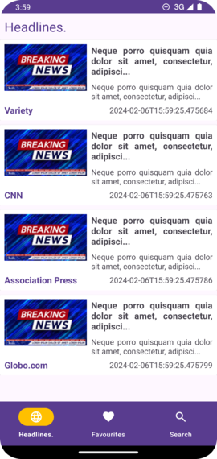
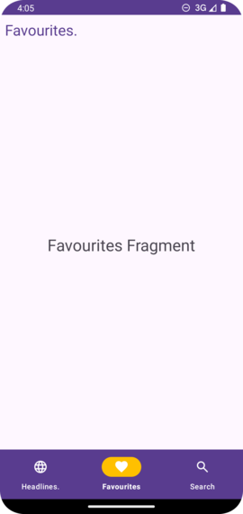
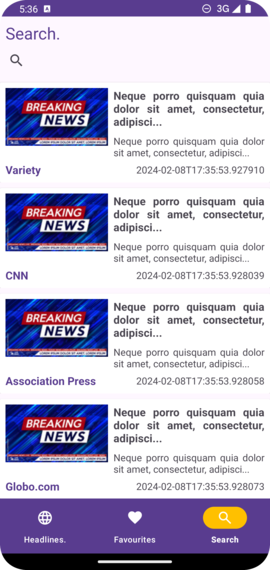

# News App

Description

## Table of contents

- [Overview](#overview)
- [The challenge](#the-challenge)
- [What I learned](#what-i-learned)
- [Design Preview](#design-preview)
- [Light Theme](#light-theme)
- [Dark Theme](#dark-theme)
- [Valuable-Resources](#valuable-resources)
- [Link to previous lesson from the course](#link-to-previous-lesson-from-the-course)

## Overview

### The challenge

Users should be able to:
- See headlines
- See favorites
- Search for news

### What I learned

Some of the things I have learned to do while coding this app were:
- How to implement a BottomNavigationView
- Hot to add a Web View to the app

## Design Preview

### Light Theme

  
  

  

  
<small><em>Headlines Section - Light Theme</em></small>  

  

  
  

  

  
<small><em>Favourites Section - Light Theme</em></small>  

  

  
  

  

  
<small><em>Search Section - Light Theme</em></small>  

  

  
  

  

  
<small><em>Web View - Light Theme</em></small>  

  

### Dark Theme

## Valuable Resources

Navigate to a destination: https://developer.android.com/guide/navigation/use-graph/navigate

Build web apps in WebView: https://developer.android.com/develop/ui/views/layout/webapps/webview